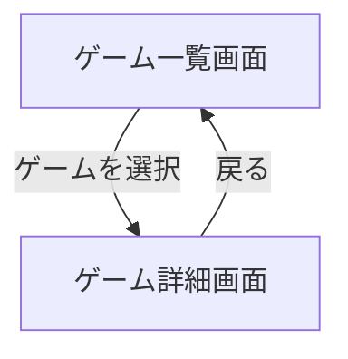

了解しました 👍
「要件定義書（Mockup用）」に **技術スタック（HTML, CSS, JavaScriptのみ）** を追加して、
静的モックアップとして簡単に作る前提でまとめ直しました。

---

# 要件定義書（Mockup用）

## 1. アプリ概要

本アプリは、ゲームアプリケーションを簡易的に管理するためのモックアップです。
ユーザーは「ゲーム一覧」を確認し、各ゲームの詳細情報を閲覧できます。
**実装は想定せず、画面遷移や機能イメージの把握を目的**とします。

---

## 2. 想定ユーザー

* 個人利用者（自分の持っているゲームを管理したい人）
* モックアップ検証を行うデザイナーや開発者

---

## 3. 技術スタック

今回のモックアップは **静的ファイルのみ** で構成します。

* **HTML**: ページ構造の定義
* **CSS**: スタイルやレイアウト
* **JavaScript**: 簡易的な画面遷移やイベント処理

※ サーバーサイド処理やフレームワークは不要。

---

## 4. 機能要件

### 4.1 画面構成

1. **ゲーム一覧画面**

   * 登録済みのゲームタイトルを一覧表示
   * 各タイトルをクリックすると「ゲーム詳細画面」へ遷移

2. **ゲーム詳細画面**

   * 選択されたゲームの以下情報を表示

     * ゲームタイトル
     * ジャンル
     * 発売日
     * 説明文
   * 「戻る」操作でゲーム一覧画面に遷移

---

### 4.2 機能一覧

* ゲーム一覧の表示
* ゲーム詳細情報の表示
* 画面間の遷移（一覧⇔詳細）

---

## 5. 画面遷移図（Mockup用）

---

## 6. 非機能要件

1. **操作性**

   * シンプルで直感的なUI
   * PC・スマートフォン両方で利用可能（レスポンシブ対応を想定）

2. **パフォーマンス**

   * 軽量で高速に動作すること（静的モックアップのため簡易でよい）

3. **拡張性**

   * 将来的にゲームデータの追加・削除を行える拡張を想定

4. **セキュリティ**

   * モックアップのため認証機能等は不要

---

 **静的モック（HTML/CSS/JavaScriptのみ）** を前提とした要件定義書。

