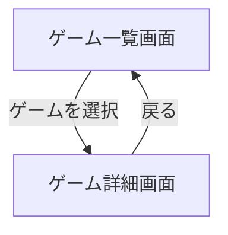

# 要件定義書（Mockup用）v2

本書は「ゲームアプリ管理モックアップ」の要件定義（静的ファイルのみ）に、実装に向けた具体的な計画（スコープ・成果物・実装ステップ等）を統合した改訂版です。実装よりも構造や画面遷移イメージの共有を目的とします。

---

## 1. アプリ概要

本アプリは、ゲームを簡易管理するためのモックアップです。ユーザーは「ゲーム一覧」を確認し、各ゲームの詳細情報を閲覧できます。実装は最小限とし、画面遷移や機能イメージの把握を主目的とします。

---

## 2. 想定ユーザー

- 個人利用者（自分の持っているゲームを管理したい人）
- モックアップ検証を行うデザイナーや開発者

---

## 3. 技術スタック（静的）

- HTML: ページ構造
- CSS: スタイル/レイアウト
- JavaScript: 簡易なDOM操作・画面間遷移

※ サーバーサイド処理・フレームワークは不要。`file://` 直開きでも動作する前提。

---

## 4. 機能要件

### 4.1 画面構成

1. ゲーム一覧画面
   - 登録済みのゲームタイトルを一覧表示
   - 各タイトルをクリックすると「ゲーム詳細画面」へ遷移

2. ゲーム詳細画面
   - 以下情報を表示: タイトル / ジャンル / 発売日 / 説明文（画像は任意）
   - 「戻る」操作で一覧画面へ遷移

### 4.2 機能一覧

- ゲーム一覧の表示
- ゲーム詳細情報の表示
- 画面間の遷移（一覧 ⇔ 詳細）

---

## 5. 画面遷移図（Mockup）



---

## 6. 非機能要件

1. 操作性: シンプルで直感的。PC/スマホ両対応（レスポンシブ）。
2. パフォーマンス: 軽量・高速（静的モックの範囲で）
3. 拡張性: 将来的なデータ追加・削除を見据えた構造
4. セキュリティ: 認証等は対象外

---

## 7. スコープ

- 対象: 一覧表示、詳細表示、一覧⇔詳細の遷移
- 非対象: 認証、データ永続化、作成/編集/削除、検索・ソート（将来拡張）

---

## 8. 成果物（ファイル/ディレクトリ）

- `src/list.html`（ゲーム一覧）
- `src/detail.html`（ゲーム詳細）
- `src/styles.css`（共通スタイル）
- `src/app.js`（最小限の挙動とモックデータ）
- `assets/`（任意の画像・アイコン）
- `docs/`（画面仕様・使い方の簡易説明）
- `tests/`（将来のテスト用。現時点では空で可）

---

## 9. 情報設計

- 一覧に表示: タイトル、ジャンル、発売日（省略可）、サムネイル（任意）
- 詳細に表示: タイトル、ジャンル、発売日、説明文、画像（任意）、戻るリンク
- 遷移設計: `list.html` → `detail.html?id={gameId}`、詳細の「戻る」→ `list.html`

---

## 10. データモデル（モック）

- `app.js` 内に配列で定義（`file://` 直開きでのCORS回避のため）
- 例スキーマ:

```js
{
  id: string,
  title: string,
  genre: string,
  releaseDate: string, // YYYY-MM-DD など
  description: string,
  image?: string       // assets配下パス（任意）
}
```

- 将来は `assets/data/games.json` へ分離し `fetch` で取得（簡易サーバ利用時）

---

## 11. UI/UX 方針

- モバイルファーストのカードレイアウト
- セマンティックHTML（`<main>`, `<section>`, `<nav>` 等）
- アクセシビリティ基本配慮（見出し階層、代替テキスト、フォーカス可視）

---

## 12. 実装ステップ

1. 雛形作成
   - ディレクトリ: `docs/`, `src/`, `assets/`, `tests/`
   - ベースファイル: `src/list.html`, `src/detail.html`, `src/styles.css`, `src/app.js`
2. モックデータ定義
   - `app.js` に3〜6件のサンプルを定義
3. 一覧画面
   - カード生成（タイトル/ジャンル/画像）
   - `detail.html?id=...` へリンク
4. 詳細画面
   - `URLSearchParams` で `id` 取得 → データ参照
   - 情報レンダリング、画像（あれば）と「戻る」リンク
5. スタイル
   - 共通ヘッダ/色/余白/タイポスケール
   - レスポンシブ（1列→2列以上）
6. ドキュメント
   - `docs/` に画面仕様・データ項目説明・動作手順

---

## 13. 受け入れ基準（Definition of Done）

- `src/list.html` をブラウザで直接開いて一覧が表示される
- 任意のゲームクリックで `src/detail.html` に遷移し該当データが表示される
- 「戻る」で `src/list.html` に戻れる
- 幅320px程度でもレイアウト破綻しない
- 可能ならJS無効時に最低限の情報（タイトル一覧）が見える構造（望ましい）

---

## 14. テスト観点（手動）

- 直開き（`file://`）で一覧→詳細→戻るが機能する
- 画像なし/データ欠損時の劣化が致命的でない（代替表示）
- 日本語文字化けが発生しない（`<meta charset="UTF-8">`）

---

## 15. 想定スケジュール（目安）

- Day 1: 雛形/モックデータ/一覧レンダリング
- Day 2: 詳細レンダリング/スタイル/レスポンシブ
- Day 3: ドキュメント整備/微調整

---

## 16. リスク/留意事項

- `file://` 前提のため、データはJS内に内包（CORS回避）
- 画像は存在しなくても動作（フォールバック文言）
- 将来の拡張（検索/ソート/CRUD）を見据え、IDとスキーマを安定化

---

## 17. 開発・動作方法

- ローカル動作: `src/list.html` をブラウザで直接開く
- 簡易サーバ（任意・スマホ検証に便利）:

```bash
npx serve .
```

---

## 18. コーディング規約（抜粋）

- HTML: セマンティックタグ（例: `<main>`, `<section>`）
- CSS: 意味のあるクラス名（例: `.game-list`, `.detail-card`）
- JS: 変数/関数名は `camelCase`、小さくシンプルな関数
- 命名例: `list.html`, `detail.html`, `styles.css`, `app.js`

---

## 19. コミット/PR ガイドライン（抜粋）

- コミットメッセージ: `feat:`, `fix:`, `docs:`, `style:`
- PR 要件: 変更概要、UI変更のスクショ、関連Issueリンク

---

以上。

